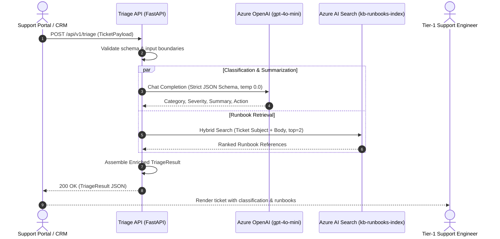

# Azure Support Ticket Triage & Enrichment Agent

[](https://www.python.org/downloads/)
[](https://fastapi.tiangolo.com)
[](https://docs.pydantic.dev/)
[](https://azure.microsoft.com/en-us/products/container-apps)
[](https://pytest.org)
[](https://learn.microsoft.com/en-us/entra/identity/managed-identities-azure-resources/)

An enterprise-grade, stateless enrichment microservice that accelerates B2B Tier-1 support workflows. The agent automatically classifies inbound support requests into domain categories and SLA severities, queries knowledge bases for matching internal runbooks via hybrid search, and drafts suggested remediation actions — returning an enriched payload to support engineers in milliseconds.

---

## Overview

Enterprise support teams handle hundreds of technical inquiries daily. Manual triage typically consumes 8–12 minutes per ticket to read, categorize, assess SLA priority, and search internal wikis for troubleshooting procedures.

This service acts as a **human-in-the-loop copilot**:
- **Classifies** incoming requests into defined business domains and SLA severities.
- **Enriches** tickets with relevant troubleshooting runbooks using hybrid search (text + vector).
- **Synthesizes** a concise summary and suggested resolution action for the Tier-1 engineer.
- **Enforces Guardrails**: Stateless design with **no direct customer auto-replies**, **no automatic ticket closures**, and **no CRM database mutations**.

```
Inbound Ticket (CRM / Portal)
          │
          ▼
┌─────────────────────────────────────────────────────────────┐
│               Azure Container Apps Microservice             │
│                                                             │
│   FastAPI (Pydantic v2 Schema Validation)                   │
│          │                                                  │
│          ├──► Azure OpenAI Service (gpt-4o-mini, temp 0.0)  │
│          │    └─► Deterministic Categorization & SLA        │
│          │                                                  │
│          └──► Azure AI Search (kb-runbooks-index)           │
│               └─► Hybrid Retrieval of Top-2 Runbooks        │
└─────────────────────────────────────────────────────────────┘
          │
          ▼
Enriched Triage Payload (Tier-1 Engineer Dashboard)
```

---

## Key Features

- **Deterministic Classification**: Powered by Azure OpenAI (`gpt-4o-mini`) using strict JSON structured outputs (`temperature: 0.0`) to guarantee rigid adherence to category and SLA schemas without hallucinations.
- **RAG-Powered Runbook Matching**: Connects to Azure AI Search using hybrid retrieval (`search_mode="all"`) to find the top matching runbooks with deduplication and relevance scoring.
- **Zero Plaintext Secrets**: Fully keyless authentication via Azure User-Assigned Managed Identity (`DefaultAzureCredential`) and least-privilege Role-Based Access Control (RBAC). No connection strings, passwords, or API keys are stored in code, configuration, or environment variables.
- **Sub-Second Performance**: Optimized execution delivering enriched results well under the 3-second SLA budget (~6 ms in local benchmarks).
- **Strict Input Validation & Resiliency**: Pydantic v2 models with explicit bounds, length ceilings, non-blank checks, and forbidden extra fields (`extra="forbid"`). Failures in external dependencies surface immediately as HTTP 502 rather than generating degraded or hallucinated fallbacks.
- **Full Offline Testability**: Zero cloud lock-in for development. Comprehensive offline mock harness (`aimock` & mock adapters) allows running unit and integration suites without cloud credentials.

---

## System Architecture



### Core Components

- **`src/schemas.py`**: Pydantic v2 domain models for inbound tickets (`TicketPayload`), runbook matches (`RunbookReference`), and output payloads (`TriageResult`).
- **`src/services/triage_service.py`**: Azure OpenAI integration utilizing strict JSON schema enforcement to classify tickets into categories (`Billing`, `Authentication`, `Infrastructure`, `Product Defect`) and severity tiers (`P1_CRITICAL` to `P4_LOW`).
- **`src/services/search_service.py`**: Azure AI Search client providing hybrid runbook retrieval, deduplication of document chunks, and score normalization.
- **`src/main.py`**: FastAPI application exposing health probes and the `/api/v1/triage` endpoint.
- **`infra/main.bicep`**: Infrastructure-as-Code provisioning Azure Container Apps, User-Assigned Managed Identity, and RBAC role assignments.

---

## Enterprise Client Integration & Tier-1 Workflow

### Where the Payload Goes: The Tier-1 Support Experience

In real enterprise client environments, support engineers do not monitor a disconnected dashboard. Support staff work within standard **IT Service Management (ITSM) or CRM systems**:
- **ServiceNow** (*Service Operations Workspace / Agent Workspace*)
- **Zendesk** (*Zendesk Agent Workspace*)
- **Jira Service Management** (*Agent Queues & Incident Views*)
- **Salesforce Service Cloud** (*Lightning Service Console*)

`azure-triage-agent` functions as an automated intelligence layer between customer intake and the engineer's ticket queue:

```
1. Customer Submission        2. CRM / Helpdesk Ingestion   3. azure-triage-agent          4. Tier-1 Support Queue
┌────────────────────┐       ┌──────────────────────────┐  ┌────────────────────┐         ┌─────────────────────────┐
│ User submits issue │──────►│ ServiceNow/Zendesk/Jira  │─►│ POST /api/v1/triage│────────►│ Ticket auto-categorized │
│ via portal, email, │       │ triggers webhook / Logic │  │ classifies & pulls │         │ with priority & private │
│ or chat widget     │       │ App workflow on creation │  │ runbooks (<50ms)   │         │ AI Copilot work note    │
└────────────────────┘       └──────────────────────────┘  └────────────────────┘         └─────────────────────────┘
```

### What the Tier-1 Engineer Sees (Internal Copilot Card)

When a Tier-1 support engineer opens an assigned ticket, the category and SLA priority dropdowns are already configured, and an **Internal Private Work Note** (visible only to engineers, never to the customer) provides immediate resolution guidance:

```
┌──────────────────────────────────────────────────────────────────────────────────┐
│ INCIDENT #41029: Invoice discrepancy on August renewal                           │
│ Requester: Acme Corp (ENTERPRISE)  |  Status: Open                               │
├──────────────────────────────────────────────────────────────────────────────────┤
│ Category: [ Billing       ▼ ]  |  Priority: [ P2 - High  ▼ ] (Auto-triaged by AI)│
├──────────────────────────────────────────────────────────────────────────────────┤
│ 🔒 INTERNAL AI COPILOT TRIAGE (Visible to staff only)                            │
│                                                                                  │
│ 📌 Summary:                                                                      │
│ Customer inquiry regarding unexpected recurring seat charges in August invoice.  │
│                                                                                  │
│ ⚡ Suggested Action:                                                             │
│ Reconcile line items against Enterprise Agreement Schedule B and issue prorated  │
│ credit note if seats were downgraded prior to the 1st.                           │
│                                                                                  │
│ 📚 Recommended Internal Runbooks:                                                │
│ 1. 🔗 [RB-102: Enterprise Billing & Invoicing Dispute Guide] (Score: 0.89)       │
│ 2. 🔗 [RB-105: Subscription Seat Adjustment & Credit Workflow] (Score: 0.81)    │
├──────────────────────────────────────────────────────────────────────────────────┤
│ CUSTOMER MESSAGE:                                                                │
│ "Hi support, our August invoice just arrived and we are being billed for 150     │
│ seats instead of the 120 we agreed on during our renewal..."                     │
└──────────────────────────────────────────────────────────────────────────────────┘
```

### Supported Integration Patterns

| Pattern | Mechanism | Best For |
|---|---|---|
| **Azure Logic Apps / Power Automate** *(Recommended)* | Low-code workflow listening to `When a ticket is created` in ServiceNow/Zendesk, calling `POST /api/v1/triage`, and updating the ticket record. | Enterprise standard: zero code changes in the CRM; separates CRM credentials from the triage agent. |
| **Native CRM Webhooks / Business Rules** | Direct webhook triggered on ticket creation pointing to `https://<container-app-url>/api/v1/triage`. | Simple direct integration within Zendesk/Freshdesk automation triggers. |
| **Event-Driven Asynchronous Pipeline** | Azure Service Bus or Event Hub consumer listening to incoming ticket events, enriching via triage, and posting updates. | High-throughput, asynchronous enterprise ingestion at scale. |

---

## API Reference

### Health Check

```http
GET /healthz
```

**Response (`200 OK`):**
```json
{
  "status": "ok"
}
```

---

### Triage & Enrichment

```http
POST /api/v1/triage
Content-Type: application/json
```

#### Request Payload (`TicketPayload`)

| Field | Type | Constraints | Description |
|---|---|---|---|
| `ticket_id` | `string` | 1–64 characters | Unique ticket identifier |
| `customer_tier` | `string` | `STANDARD`, `PREMIUM`, or `ENTERPRISE` | Customer service tier |
| `subject` | `string` | 1–200 characters, non-blank | Brief issue summary |
| `body` | `string` | 1–20,000 characters, non-blank | Full issue description |

**Example Request:**
```json
{
  "ticket_id": "T-8001",
  "customer_tier": "PREMIUM",
  "subject": "Billing invoice mismatch for August",
  "body": "Customer reports discrepancy in August recurring charges and enterprise seats."
}
```

#### Response Payload (`TriageResult`)

| Field | Type | Description |
|---|---|---|
| `ticket_id` | `string` | Echoed ticket identifier |
| `category` | `string` | `Billing`, `Authentication`, `Infrastructure`, or `Product Defect` |
| `severity` | `string` | `P1_CRITICAL`, `P2_HIGH`, `P3_MEDIUM`, or `P4_LOW` |
| `summary` | `string` | AI-generated 1–2 sentence issue distillation |
| `suggested_action` | `string` | Recommended immediate remediation step for the human agent |
| `matched_runbooks` | `array` | Top-ranked runbooks matching the inquiry (up to 2) |

**Example Response (`200 OK`):**
```json
{
  "ticket_id": "T-8001",
  "category": "Billing",
  "severity": "P2_HIGH",
  "summary": "Customer inquiry regarding invoice discrepancy for August billing cycle.",
  "suggested_action": "Review billing line items against enterprise agreement and apply credit if warranted.",
  "matched_runbooks": [
    {
      "document_id": "rb-billing-04",
      "title": "Invoice Reconciliation & Billing Dispute Resolution",
      "relevance_score": 0.89
    }
  ]
}
```

#### HTTP Status Codes

- `200 OK`: Successful triage and enrichment.
- `422 Unprocessable Entity`: Request payload failed validation (e.g. unknown fields, whitespace-only content, oversized text, invalid tier).
- `502 Bad Gateway`: Upstream cloud dependency error (Azure OpenAI or Azure AI Search failure).

---

## Configuration

Configuration is managed via environment variables using Pydantic Settings.

| Environment Variable | Default Value | Description |
|---|---|---|
| `AZURE_TRIAGE_AZURE_OPENAI_ENDPOINT` | `https://placeholder.openai.azure.com/` | Azure OpenAI resource endpoint |
| `AZURE_TRIAGE_AZURE_OPENAI_API_VERSION` | `2024-12-01-preview` | Azure OpenAI REST API version |
| `AZURE_TRIAGE_AZURE_OPENAI_CHAT_DEPLOYMENT` | `gpt-4o-mini` | Deployed model deployment name |
| `AZURE_TRIAGE_AZURE_SEARCH_SERVICE_ENDPOINT` | `https://placeholder.search.windows.net` | Azure AI Search service endpoint |
| `AZURE_TRIAGE_AZURE_SEARCH_INDEX_NAME` | `kb-runbooks-index` | Target search index name |
| `AZURE_TRIAGE_REQUEST_TIMEOUT_SECONDS` | `5.0` | HTTP request timeout for upstream APIs |
| `AZURE_TRIAGE_MOCK` | `false` | Enable local offline mock mode (`aimock`) |

> **Security Note:** In production, cloud services authenticate strictly via Azure Managed Identity. Never provide API keys or secret tokens.

---

## Quickstart & Local Development

### Prerequisites

- Python 3.11+
- [`uv`](https://github.com/astral-sh/uv) (recommended) or standard Python `venv` + `pip`
- (Optional) Azure CLI & Bicep CLI for cloud deployment

### 1. Installation

Clone the repository and install all dependencies:

```bash
git clone https://github.com/Mikehutu/azure-triage-agent.git
cd azure-triage-agent
uv sync
```

### 2. Run Test Suite & Quality Gates

Run all automated unit and integration tests:

```bash
# Run unit tests with code coverage (100% coverage enforced)
uv run pytest tests/unit/ -v

# Run practical end-to-end tests against live server instances over real TCP sockets
bash scripts/run-e2e.sh
# or directly with pytest:
uv run pytest tests/e2e/ --no-cov -v

# Run the complete mechanical verification pipeline (G1-G5: lint, typecheck, bicep, unit, e2e, secrets scan)
bash scripts/run-gates.sh
```

> For in-depth testing documentation, test suite architecture, and scenario coverage, see [`docs/TESTING.md`](docs/TESTING.md).

### 3. Run Locally with Offline Mocks

You can run the full service locally without Azure credentials using the mock harness:

```bash
# Step A: Start the offline mock server in the background
aimock -c aimock/aimock.json -p 4010 &

# Step B: Start the FastAPI service pointing to the mock server
AZURE_TRIAGE_MOCK=1 \
AZURE_TRIAGE_AZURE_OPENAI_ENDPOINT=http://127.0.0.1:4010 \
uv run uvicorn src.main:app --host 127.0.0.1 --port 8000
```

### 4. Verify Local Endpoint

Send a sample triage request:

```bash
curl -X POST http://127.0.0.1:8000/api/v1/triage \
  -H "Content-Type: application/json" \
  -d '{
    "ticket_id": "T-1001",
    "customer_tier": "ENTERPRISE",
    "subject": "Intermittent MFA authentication failures",
    "body": "Users are reporting timeout errors when attempting MFA authentication across multiple regions."
  }'
```

---

## Azure Deployment & Infrastructure

The service is packaged as a container and deployed to **Azure Container Apps** using Bicep.

### Infrastructure Architecture

- **Azure Container Apps**: Serverless container execution with scale-to-zero capability (0 to 3 replicas) and 0.5 vCPU / 1.0 GiB memory allocation.
- **User-Assigned Managed Identity**: Created with the container app and assigned directly to the execution environment.
- **RBAC Role Assignments**:
  - `Cognitive Services OpenAI User` (`5e0bd9bd-7b93-4f28-af87-19fc36ad61bd`) on the Azure OpenAI account.
  - `Search Index Data Reader` (`1407120a-92aa-4202-b7e9-c0e197c71c8f`) on the Azure AI Search resource.

### Deploying via Azure CLI

1. Compile and validate the Bicep template:
   ```bash
   bicep build infra/main.bicep
   ```

2. Deploy the infrastructure to your target resource group:
   ```bash
   az deployment group create \
     --resource-group <your-resource-group> \
     --template-file infra/main.bicep \
     --parameters \
       containerImage=<your-registry>.azurecr.io/azure-triage-agent:latest \
       openAiAccountName=<your-azure-openai-account> \
       searchServiceName=<your-azure-search-service> \
       chatDeploymentName=gpt-4o-mini
   ```

---

## Project Structure

```
azure-triage-agent/
├── infra/
│   └── main.bicep               # Azure Container Apps & RBAC infrastructure template
├── src/
│   ├── __init__.py
│   ├── config.py                # Pydantic Settings configuration
│   ├── main.py                  # FastAPI route definitions & dependency injection
│   ├── schemas.py               # Pydantic v2 request/response models & validators
│   └── services/
│       ├── __init__.py          # Service factory & client initialization
│       ├── search_service.py    # Azure AI Search hybrid retrieval service
│       └── triage_service.py    # Azure OpenAI classification & structured output service
├── tests/
│   ├── fixtures/                # Sample ticket payloads & mock responses
│   ├── unit/                    # Unit test suite (100% line coverage)
│   └── e2e/                     # Practical live-server end-to-end test suite
├── aimock/                      # Offline mock definitions & local fixtures
├── scripts/
│   ├── run-gates.sh             # Mechanical verification pipeline runner (G1-G5)
│   └── run-e2e.sh               # Standalone practical e2e test runner
├── pyproject.toml               # Project dependencies, tools, and lint configurations
└── README.md                    # Project documentation
```

---

## Quality Assurance & Standards

The codebase adheres to rigorous engineering and quality standards:

- **Strict Static Typing**: Enforced with `mypy --strict` across all source files.
- **Code Style & Linting**: Formatted and linted with `ruff`.
- **Test Coverage**: Maintained at 100% line coverage across all service logic with `pytest`.
- **Secret Scanning**: Continuous automated checks verify zero hardcoded tokens or secrets.
- **Infrastructure Validation**: Bicep templates compile cleanly with zero warnings.

---

## License

This project is licensed under the MIT License.
